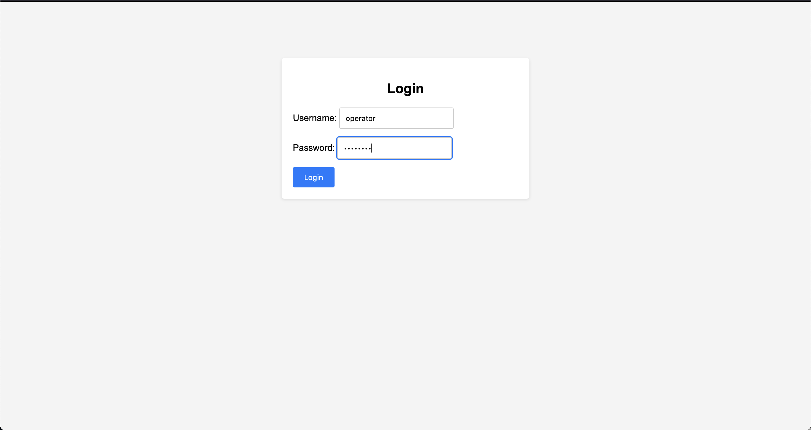
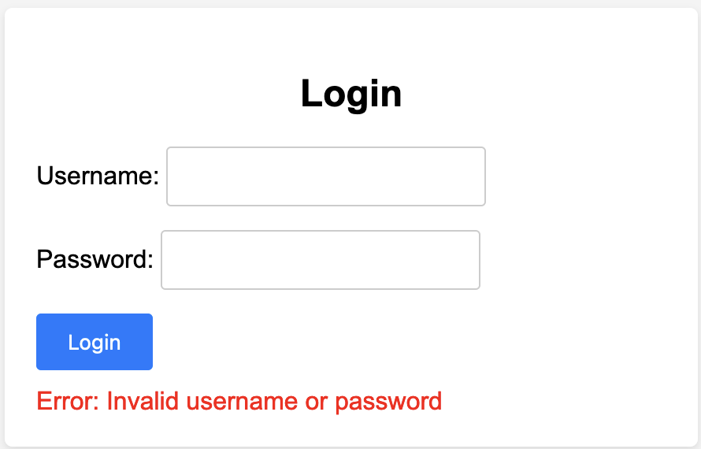
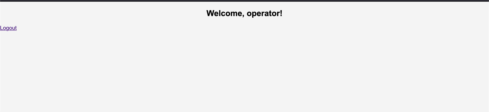

## Login Functionality for Gemini

Q: Do I do log in function for each role? Or just login in general.
A: TBA

**Username**: `operator`

**Password**: `password`

### Screenshot

#### Incorrect

#### Correct
